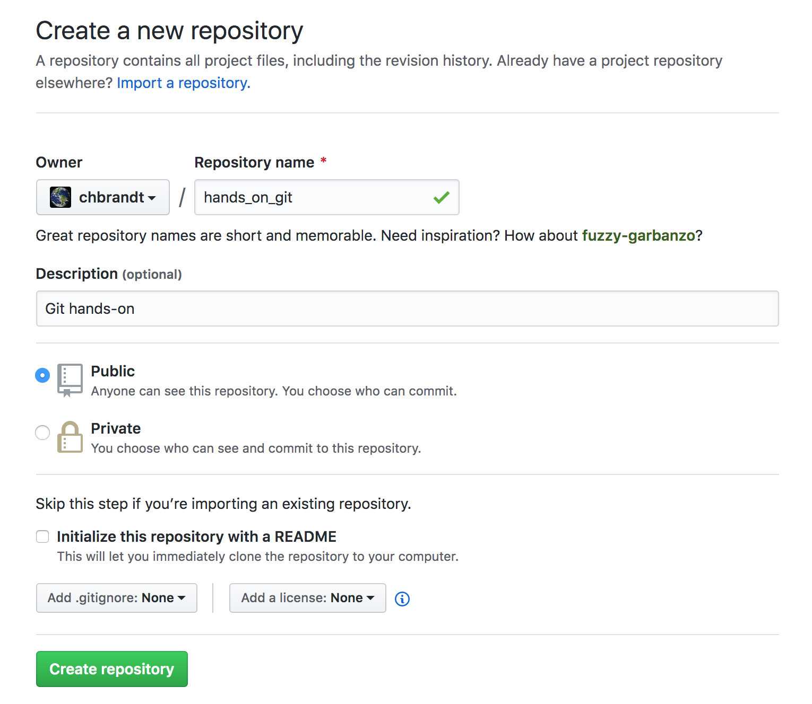

# Github

## Create a repository

To create a repository in Github for instance (same for Bitbucket, Gitlab, etc.)
is straightforward. Each platform has its own, usually very good documentation
on the steps.
For simplicity I present here the two screens one has to handle for creating
a repository on Github.

After you opt for creating a `New repository` by clicking at the top-right `+`
button you'll have the following screen for you:

